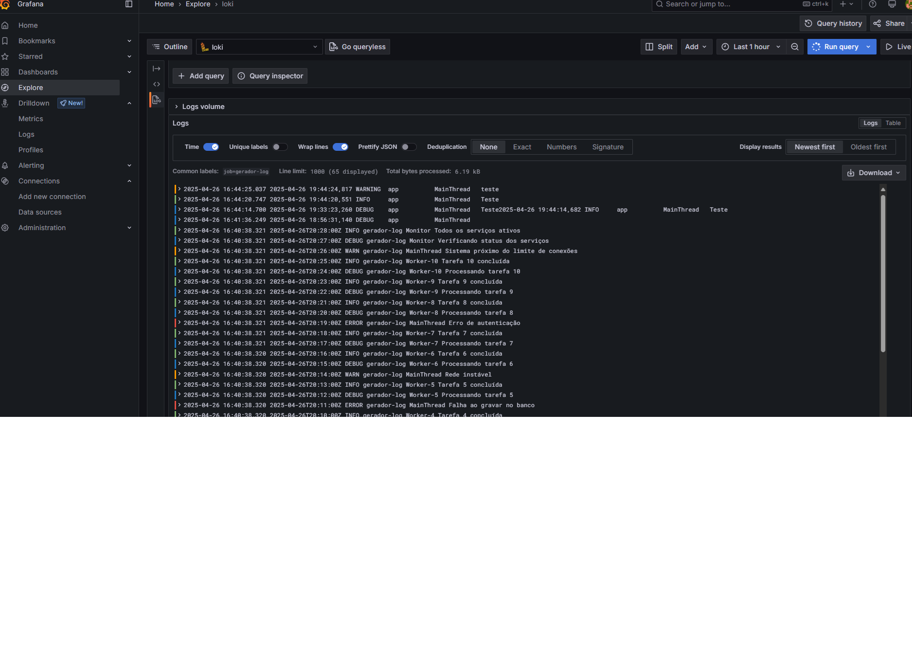
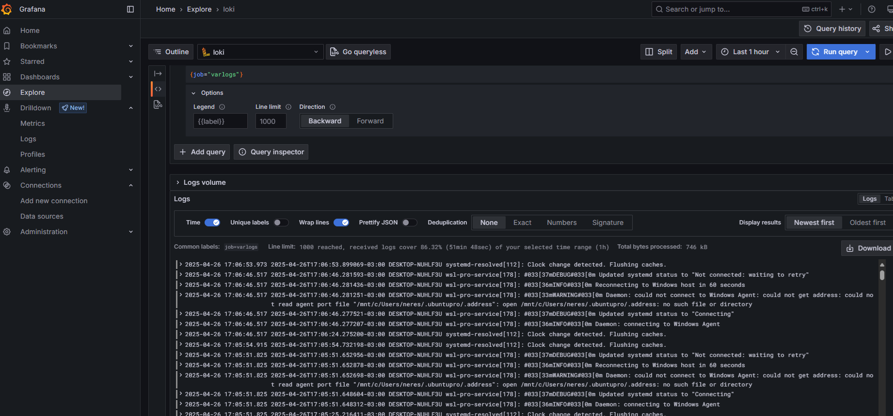
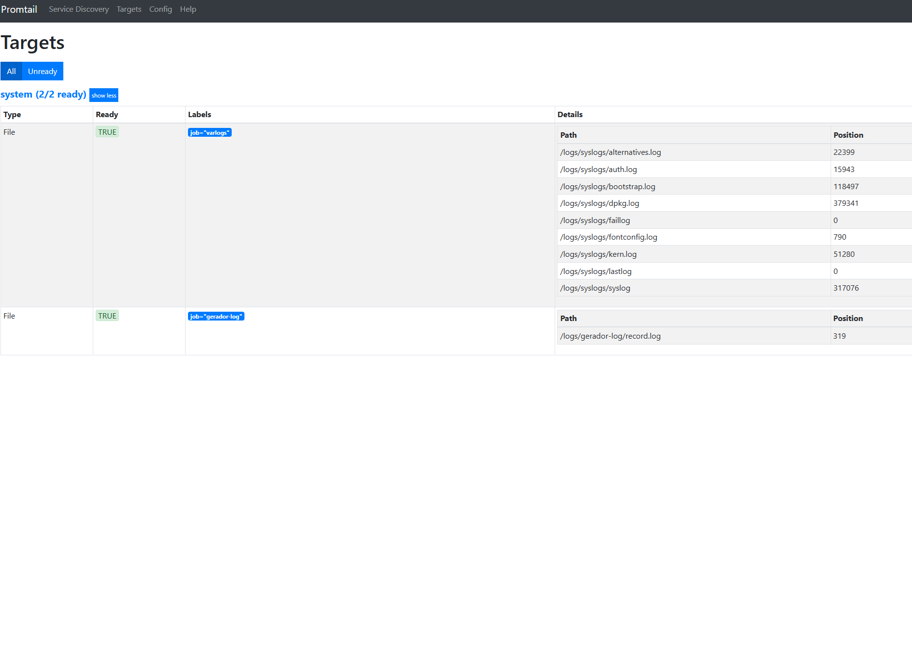

  <h1>Trabalho de Monitoramento de Logs</h1>
  
Este repositório contém a configuração para um pipeline de monitoramento de logs usando Docker Compose, Grafana Loki e Promtail.

  <h2>📁 Estrutura de Diretórios</h2>
  <pre><code>.
├── docker-compose.yml        # Orquestração dos serviços
├── promtail/
│   ├── config.yaml           # Configuração do Promtail
│   └── position/
│       └── positions.yaml    # Arquivo de posições de leitura
└── logs/
    └── gerador-log/
        └── record.log        # Exemplo de logs gerados
</code></pre>

  <h2>📋 Descrição dos Arquivos</h2>

  <h3>1. <code>docker-compose.yml</code></h3>
  
Define e conecta quatro serviços principais em uma rede Docker chamada <strong>loki</strong>:

  <ul>
    <li>
      <strong>gerador-logs</strong> 
      <em>Imagem:</em> <code>fabricioveronez/gerador-log</code> 
      <em>Portas:</em> expõe <code>8080</code> (host) → <code>5000</code> (container) 
      <em>Volumes:</em> <code>./logs/gerador-log</code> para persistência 
      Gera logs que são colhidos pelo Promtail.
    </li>
    <li>
      <strong>promtail</strong> 
      <em>Imagem:</em> <code>grafana/promtail:2.7.5</code> 
      <em>Depende de:</em> <code>loki</code> e <code>gerador-logs</code> 
      <em>Porta HTTP de scraping:</em> <code>9080</code> 
      <em>Volumes montados:</em>
      <ul>
        <li><code>promtail/config/config.yaml</code> → <code>/etc/promtail/config.yml</code></li>
        <li><code>/var/log</code> → <code>/logs/syslogs/</code></li>
        <li><code>./logs/gerador-log</code> → <code>/logs/gerador-log/</code></li>
        <li><code>./promtail/position</code> → <code>/position</code></li>
      </ul>
      Responsável por coletar (scrape) e enviar logs para o Loki.
    </li>
    <li>
      <strong>loki</strong> 
      <em>Imagem:</em> <code>grafana/loki:2.7.5</code> 
      <em>Porta de API:</em> <code>3100</code> 
      Recebe requisições de push de logs do Promtail.
    </li>
    <li>
      <strong>grafana</strong> 
      <em>Imagem:</em> <code>grafana/grafana</code> 
      <em>Porta de interface:</em> <code>3000</code> 
      Conecta-se ao Loki para visualização e criação de dashboards de logs.
    </li>
  </ul>

  <h3>2. <code>promtail/config/config.yaml</code></h3>
  <pre><code>server:
  http_listen_port: 9080
  grpc_listen_port: 0

positions:
  filename: /position/positions.yaml

clients:
  - url: http://loki:3100/loki/api/v1/push

scrape_configs:
  - job_name: system
    static_configs:
      - targets: [ "localhost" ]
        labels:
          job: varlogs
          __path__: /logs/syslogs/*log

  - job_name: gerador-log
    static_configs:
      - targets: [ "localhost" ]
        labels:
          job: gerador-log
          __path__: /logs/gerador-log/*log
</code></pre>
  <ul>
    <li><strong>server:</strong> porta usada pelo Promtail para health-check.</li>
    <li><strong>positions:</strong> armazena o offset de leitura para retomar logs onde parou.</li>
    <li><strong>clients:</strong> URL de destino para envio de logs (Loki).</li>
    <li><strong>scrape_configs:</strong> define dois jobs:
      <ol>
        <li><strong>system:</strong> captura todos os arquivos <code>.log</code> em <code>/logs/syslogs/</code> (logs do sistema).</li>
        <li><strong>gerador-log:</strong> captura <code>record.log</code> do serviço gerador.</li>
      </ol>
    </li>
  </ul>

  <h3>3. <code>promtail/position/positions.yaml</code></h3>
  <pre><code>positions:
  /logs/gerador-log/record.log: "319"
  /logs/syslogs/alternatives.log: "22399"
  /logs/syslogs/auth.log: "15943"
  /logs/syslogs/bootstrap.log: "118497"
  /logs/syslogs/dpkg.log: "379341"
  /logs/syslogs/faillog: "0"
  /logs/syslogs/fontconfig.log: "790"
  /logs/syslogs/kern.log: "51280"
  /logs/syslogs/lastlog: "0"
  /logs/syslogs/syslog: "298098"
</code></pre>
  
Cada entrada mapeia o caminho de um arquivo à linha já consumida.

  <h3>4. <code>logs/gerador-log/record.log</code></h3>
  <pre><code>2025-04-26 18:56:31,140 DEBUG   app MainThread Teste
2025-04-26 19:33:23,260 DEBUG   app MainThread Teste
2025-04-26 19:44:14,682 INFO    app MainThread Teste
2025-04-26 19:44:20,551 INFO    app MainThread Teste
2025-04-26 19:44:24,817 WARNING app MainThread Teste
</code></pre>
  <ul>
    <li><strong>Formato de timestamp:</strong> <code>YYYY-MM-DD HH:MM:SS,mmm</code></li>
    <li><strong>Nível de log:</strong> <code>DEBUG</code>, <code>INFO</code>, <code>WARNING</code>, etc.</li>
  </ul>

  <h2>▶️ Como Iniciar o Ambiente</h2>
  <ol>
    <li><strong>Clone o repositório:</strong>
      <pre><code>git clone https://github.com/neresfelip/trabalho-pos-monitoramento-logs
cd trabalho-pos-monitoramento-logs
</code></pre>
    </li>
    <li><strong>Suba os serviços:</strong>
      <pre><code>docker-compose up -d</code></pre>
    </li>
    <li><strong>Acesse as interfaces:</strong>
      <ul>
        <li>Grafana: <a href="http://localhost:3000">http://localhost:3000</a></li>
        <li>Loki API: <a href="http://localhost:3100">http://localhost:3100</a></li>
        <li>Promtail (health): <a href="http://localhost:9080">http://localhost:9080</a></li>
        <li>Gerador de Logs: <a href="http://localhost:8080">http://localhost:8080</a></li>
      </ul>
    </li>
  </ol>

  <h2>🛠️ Observações</h2>
  <ul>
    <li>Para zerar as posições e remontar todos os logs, apague o arquivo <code>promtail/position/positions.yaml</code>.</li>
    <li>Ajuste o <code>__path__</code> em <code>scrape_configs</code> do <code>config.yaml</code> caso adicione novos diretórios de logs.</li>
  </ul>

  <h2>📸 Prints</h2>
  <ul>
    <li>Grafana lendo os logs gerados pelo gerador de logs 
    </li>
    <li>Grafana lendo os logs do varlogs do Linux 
    </li>
    <li>Targets de logs definidos pelo Promtail 
    </li>
  </ul>

  
<strong>Autor:</strong> Felipe Neres Ribeiro - Matrícula: 2327959 
     <strong>Data:</strong> 26-04-2025

